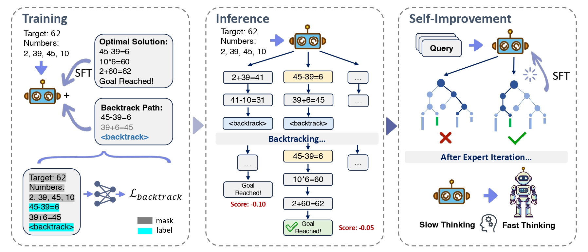
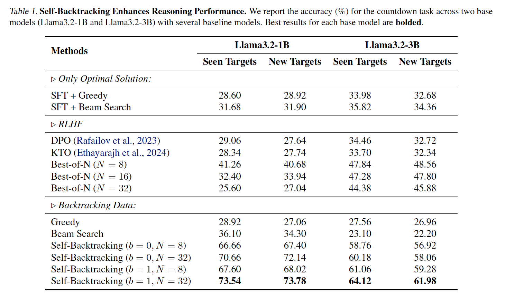

# Step Back to Leap Forward: Self-Backtracking for Boosting Reasoning of Language Models

[](https://www.arxiv.org/abs/2502.04404)
[](https://huggingface.co/papers/2502.04404)
[](https://github.com/LAMDASZ-ML/Self-BackTracking)
[](https://github.com/LAMDASZ-ML/Self-BackTracking)
[](https://github.com/LAMDASZ-ML/Self-BackTracking/stargazers)

A novel self-backtracking method for improving language model reasoning.



## Overview
This repository implements the Self-BackTracking method, that equips LLMs with the ability to backtrack during both training and inference. This mechanism not only enhances reasoning ability but also efficiency by transforming slow-thinking processes into fast-thinking through self-improvement.

## Dataset and Model
The project utilizes the Countdown dataset, which is pre-constructed and accessible on Hugging Face. Additionally, we have open-sourced our trained model based on Llama-3.2-1B.

[](https://huggingface.co/datasets/yangxw/countdown-backtracking)
[](https://huggingface.co/yangxw/Llama-3.2-1B-countdown-backtrack)
## Getting Started

### Environment Setup (important)
- Python: 3.10–3.11 recommended.
- Create and activate a virtual environment.
- Install pinned dependencies to avoid NumPy/torch/torchvision ABI issues:

```
python -m venv .venv
source .venv/bin/activate  # Windows: .venv\Scripts\activate
python -m pip install -U pip setuptools wheel
pip install --no-cache-dir --upgrade --force-reinstall -r requirements.txt
```

If you still see errors like "A module that was compiled using NumPy 1.x cannot be run in NumPy 2.x" or
"module 'torch.library' has no attribute 'register_fake'", ensure these pairs are installed and active:

- numpy==1.26.4
- torch==2.1.2 and torchvision==0.16.2 (matching versions)

You can enforce this with:

```
pip uninstall -y numpy torchvision
pip install --no-cache-dir numpy==1.26.4 torchvision==0.16.2
```

Optionally, if you do not use any vision models, removing torchvision completely also avoids the import path:

```
pip uninstall -y torchvision
```

Weights & Biases logging is optional. To enable `--wandb`, install it:

```
pip install wandb
```

### Dataset Notes
- The training scripts expect the Hugging Face dataset `yangxw/countdown-backtracking` with columns: `nums`, `target`, and `search_path`.
- If the upstream dataset script is temporarily inconsistent, the code falls back to downloading raw files from the Hub and constructing the dataset locally.
- If `search_path` is missing, training cannot proceed. Please retry after the upstream dataset is fixed or supply local files that include these columns.

### Training
To train the model:

```bash
CUDA_VISIBLE_DEVICES=0 python train.py \
    --config ../configs/sft.conf
```
You can change the parameters in the `configs/sft.conf` file.

- New: control training subset size with `dataset_percent` (default 2.0). Example: set to 5 for training on 5% of the dataset. If `dataset_percent` is not present, the script falls back to the legacy `num_train` count; otherwise it defaults to 2%.

If you want to use multiple GPUs:
```bash
accelerate launch \
    --config_file ../configs/accelerate.yaml \
    train.py \
    --config ../configs/sft.conf
```

### Inference
To inference the model using our self-backtracking method, you can run the following command:
```bash
CUDA_VISIBLE_DEVICES=0 python eval_search.py \
    --num 5000 \
    --ckpt [your_model_ckpt] \
    --data [val/val_new] \
    --decoder self_backtrack \
    --b 1 \
    --n 32
```
--ckpt defaults to `yangxw/Llama-3.2-1B-countdown-backtrack`. You can use our trained model available on Hugging Face.

### Performance Fast Path
- SDPA/TF32 flags and optional TorchInductor compile are applied via `src/optim/perf.py` when models load in `src/train.py`, `src/eval_search.py`, and `src/train_self_improvement.py`.
- To JIT-compile the model with TorchInductor, set `AZR_COMPILE=1` (falls back safely if unsupported):

```
AZR_COMPILE=1 CUDA_VISIBLE_DEVICES=0 python src/eval_search.py --decoder self_backtrack --num 128
```

- Training uses fused AdamW (`optim="adamw_torch_fused"`) for faster optimizer steps.

- Optional Triton RMSNorm: enable with `AZR_TRITON_RMSNORM=1` if Triton is available to replace Llama RMSNorm with a fused Triton kernel (forward + backward).

- Optional Triton RoPE: enable with `AZR_TRITON_ROPE=1` to patch LLaMA rotary embedding with a fused Triton kernel (forward + backward) applied to Q/K.

- Optional Fused QKV: enable with `AZR_FUSE_QKV=1` to fuse `q_proj`/`k_proj`/`v_proj` into a single GEMM per attention block via a light monkey-patch. Parameters and HF APIs remain compatible.

- Optional RoPE Epilogue (on-the-fly): set `AZR_ROPE_EPI=1` along with `AZR_TRITON_ROPE=1` to compute RoPE angles inside the Triton kernel using the model's `inv_freq` and `position_ids`. This eliminates cos/sin gathers and further reduces memory traffic. Requires CUDA.

### Self-Improvement
To further improve the model, you can run the following command:
```bash
CUDA_VISIBLE_DEVICES=0 python train_self_improvement.py \
    --num 5000 \
    --past_model [your_model_ckpt] \
    --data [val/val_new]
```

## Results

## Citation
If you use this work, please cite it as follows:

```
@article{selfbacktracking,
  title={Step Back to Leap Forward: Self-Backtracking for Boosting Reasoning of Language Models},
  author={Xiao-Wen Yang and Xuan-Yi Zhu and Wen-Da Wei and Ding-Chu Zhang and Jie-Jing Shao and Zhi Zhou and Lan-Zhe Guo and Yu-Feng Li},
  journal={arXiv preprint arXiv:2502.04404},
  year={2025}
}
```
